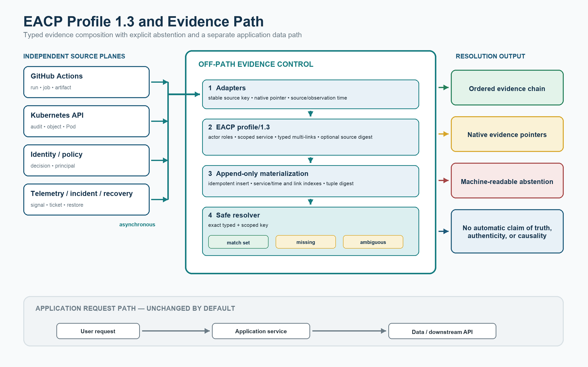
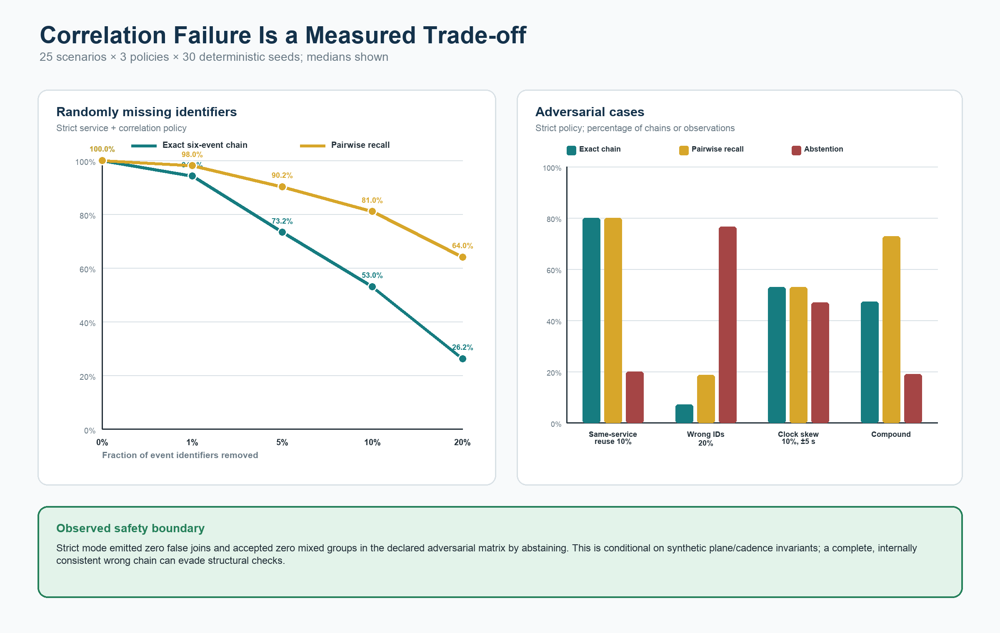
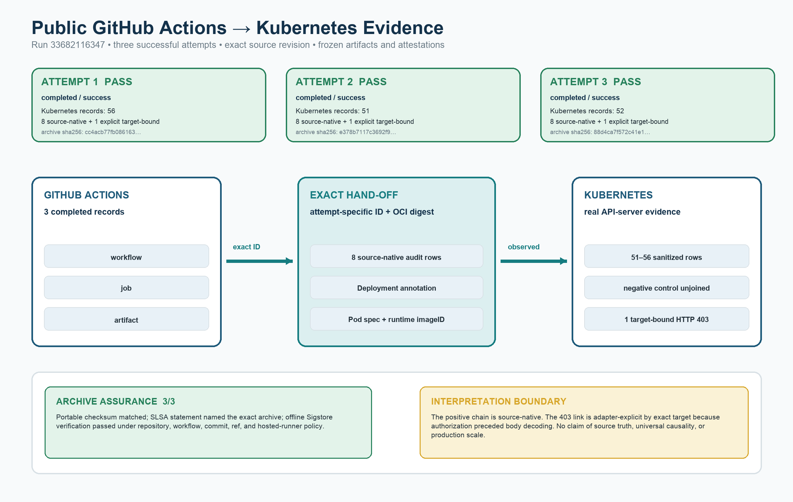

# Reviewer guide — EACP 1.3 candidate

Status: reviewer candidate, 2026-09-02. This branch is not an archival release,
has not undergone peer review, and has no v1.3 DOI. The DOI-backed release
remains v1.2.0; see [archival status](#version-and-archival-status).

Three source anchors must not be conflated: the earlier three-attempt live run
used commit `76b2ed54381ae52cf0f54cd22a20341c3216b77b`; the initial cross-version
protocol was frozen at
[`15d72da`](https://github.com/obedebessa/eacp-operational-provenance/tree/15d72da095a0c7640b9318b50b28728e76d68928);
and its narrow prospective amendment is the direct child
[`4cbf7d2`](https://github.com/obedebessa/eacp-operational-provenance/tree/4cbf7d2fa0bb44585d258a3f37ce0c0d39ddea43).
The two cross-version generations have separate run sets, summaries, and
checksum inventories.

## The contribution in one sentence

EACP 1.3 is a domain-specific operational-provenance profile and materialized
retrieval index that composes records separately emitted by delivery and
runtime-control systems at service granularity, retains native evidence pointers, and abstains
when an explicit cross-plane link is absent or structurally ambiguous.

This is a deliberately bounded claim. EACP is not presented as a new general
provenance model, a causal-inference engine, an attestation system, a SIEM, or a
replacement for tracing, in-toto/SLSA, Sigstore, Tekton Chains, Grafeas, or the
authoritative systems that emitted the evidence.



## Suggested review path

1. Read the [concise evidence brief](EVIDENCE_BRIEF_v1.3.md) for the failure,
   amendment, confirmation, and all public cross-version run IDs.
2. Read the normative [EACP Profile 1.3](spec/EACP_PROFILE_v1.3.md), especially
   actor roles, scoped service identities, typed links, and safe resolution.
3. Inspect the [correlation-robustness protocol and results](experiments/correlation_robustness/README.md).
   This is the primary test of what happens when identifiers fail.
4. Inspect the [live GitHub Actions → Kubernetes protocol](experiments/github_actions/README.md),
   the [preserved initial cohort](experiments/github_actions/results/reference/cross-version-initial-failed-cohort-v1.3/README.md),
   the [confirmatory cohort](experiments/github_actions/results/reference/cross-version-confirmatory-cohort-v1.3/README.md),
   and the separately reported [earlier three-attempt run](experiments/github_actions/results/reference/run-33682116347/README.md).
5. Inspect the [SQLite index ablation](experiments/index_ablation/README.md) to
   separate normalization from the lookup indexes' measured benefit and cost.
6. Use the original v1.2 Kubernetes and OpenTelemetry materials only as the
   continuity baseline; they are not substitutes for the v1.3 experiments.

For a claim-by-claim audit, use the
[claims and evidence ledger](CLAIMS_AND_EVIDENCE_v1.3.md). A prospective
[external replication protocol](experiments/github_actions/EXTERNAL_REPLICATION_PROTOCOL_v1.3.md)
predeclares acceptance and failure criteria; no external replication is claimed.

## What changed materially after v1.2

| Review question | v1.3 evidence |
|---|---|
| Is the data model implementable and unambiguous? | A versioned profile, three JSON Schemas, a standard-library validator/migrator/resolver, explicit source identity, actor roles, scoped services, typed multivalued links, precise digest semantics, and machine-readable abstention. |
| What happens when correlation identifiers are missing, wrong, reused, duplicated, delayed, reordered, or clock-skewed? | A deterministic 25-scenario × 3-policy × 30-seed campaign (2,250 trial rows) reports exact-chain, pairwise, false-join, abstention, ambiguity, conflict, and time-to-completeness metrics. |
| Is the indexed lookup result merely an unexplained implementation choice? | A paired four-treatment ablation removes the two lookup indexes independently and together while asserting row-for-row result equivalence. |
| Does “cross-plane” include two real emitters? | The GitHub API and Kubernetes API server emit separate records. In the successful controlled runs, those records compose through a workflow-generated key planted in the positive Kubernetes annotations; identifier discovery is not tested. |
| Was an unfavorable result from a prospectively committed protocol retained? | Yes. The initial balanced 3-by-3 cohort preserves nine first-attempt failures and reports 0/9 runs satisfying all predeclared criteria. A direct-child amendment and nine new tag names were allocated before confirmation; capture-time API queries observed one matching invocation per exact tag. |
| Did the narrow correction confirm across the pinned targets? | The confirmatory 3-by-3 cohort records 9/9 first-attempt workflow successes and 9/9 runs satisfying all predeclared criteria, 3/3 on each of Kubernetes v1.34.8, v1.35.5, and v1.36.1. |
| What exactly is authenticated? | The GitHub build-provenance attestation names only each in-run TAR as its subject. Local completed-state finalization is checksum-bound and public-API-cross-checkable but not builder-attested. Capture-time default-trust verification passed; the captured root enables offline re-verification relative to captured bytes but is not self-authenticating. |

## Results worth scrutinizing

All percentages below are medians from the checked-in machine-readable files
unless the row describes discrete public workflow outcomes.

| Result | Observation | Boundary |
|---|---|---|
| Randomly missing IDs | Exact six-event-chain recovery declined from 94.17% at 1% missing to 26.17% at 20% missing; pairwise recall declined from 98.01% to 64.02%. Strict mode abstained on the affected observations and emitted no false joins in these scenarios. | Synthetic six-plane cadence; the result is not a universal missing-data law. |
| Wrong IDs and reuse | At 20% same-service wrong-ID substitution, strict mode recorded 7.08% exact-chain accuracy, 76.53% abstention, 18.66% pairwise recall, and no false joins. At 10% same-service reuse pairs, it recorded 80.00% exact-chain accuracy and 20.00% abstention. | Structural checks detect the declared violations. A complete, internally consistent wrong chain can evade them. |
| Compound disruption | Strict mode recorded 47.33% exact-chain accuracy, 49.82% exact-chain F1, 19.01% abstention, 72.86% pairwise recall, and no false joins. | Safety is conditional on the declared generator and invariants; lower coverage is an explicit cost, not hidden success. |
| Index ablation at 100k events | Removing the target index changed warm service-query p95 by 5.65× and warm correlation-query p95 by 73.91×. Removing both indexes reduced database bytes by 22.776% and median paired ingestion time by 17.900%. | Local, sequential SQLite workload. Ratios compare paired EACP variants, not different products. |
| Earlier live cross-plane execution | Attempts 1–3 of public run [33682116347](https://github.com/obedebessa/eacp-operational-provenance/actions/runs/33682116347) all satisfied the exact-link, no-ID negative-control, target-bound HTTP 403, subject-digest, checksum, and attestation-subject checks. | Three rerun attempts under one run ID; kept separate from both cross-version generations. |
| Initial prospectively committed 3-by-3 | Nine distinct first-attempt runs at `15d72da`, three per Kubernetes version, all reached exact client/server/kubelet validation and then the same premature artifact-lifecycle assertion. | Nine preserved failures; 0/9 satisfied all predeclared criteria. Minimized API metadata and failure markers are locally captured and checksum-bound; neither is an origin-signed response. |
| Confirmatory 3-by-3 | New tags `run-04..06` at direct-child `4cbf7d2` produced 9/9 first-attempt workflow successes and 9/9 runs satisfying all predeclared criteria, with 3/3 on each pinned Kubernetes version and nine distinct run and correlation IDs. | Same repository, provider, workflow family, hosted-runner class, and ephemeral single-node kind design; descriptive compatibility and procedural repetition only. |

For each earlier live attempt—and under the same bounded checks in each
successful confirmatory run—the completed view contains three GitHub records,
positive Kubernetes audit records carrying the exact correlation annotation,
and one target-bound HTTP 403 whose correlation is asserted by the adapter. The
403 record did **not** carry a source-native correlation ID and is labeled
`adapter_explicit_exact_target`. The present no-ID control remained unjoined.
The Deployment, Pod specification, and runtime image ID matched the pinned OCI
subject digest as a separate check.

The workflow itself generated the attempt-specific correlation identifier and
wrote it into the positive Deployment and Pod-template annotations. The live
study therefore evaluates controlled propagation and exact composition of an
introduced key; it does not evaluate discovery of naturally occurring
identifiers. Here, “source-native” means that the retained raw Kubernetes audit
record contains the workflow-injected annotation—not that the identifier arose
independently. The OCI digest match is checked separately from correlation.





## Fast local artifact verification

From the repository root, these checks do not rerun timing experiments or
create a cluster:

```bash
python3 spec/tools/eacp_profile.py validate \
  spec/examples/valid-record-v1.3.json

python3 experiments/github_actions/summarize_reference_run.py --verify

python3 experiments/github_actions/summarize_cross_version_run_set.py \
  --root experiments/github_actions/results/reference/cross-version-initial-failed-cohort-v1.3 \
  --target-manifest experiments/github_actions/kubernetes_targets_v1.3.json \
  --verify

python3 experiments/github_actions/summarize_cross_version_run_set.py \
  --root experiments/github_actions/results/reference/cross-version-confirmatory-cohort-v1.3 \
  --target-manifest experiments/github_actions/kubernetes_targets_v1.3.json \
  --verify

python3 experiments/index_ablation/index_ablation.py \
  --verify experiments/index_ablation/results/reference

(cd experiments/correlation_robustness/results/reference && \
  shasum -a 256 -c SHA256SUMS)
```

Run the candidate-specific test suites:

```bash
python3 -m unittest discover -s spec/tests -v
python3 -m unittest discover -s experiments/github_actions/tests -v
python3 -m unittest discover -s experiments/correlation_robustness -p 'test_*.py' -v
python3 -m unittest discover -s experiments/index_ablation -p 'test_*.py' -v
```

The successful archives can also be checked against the exact repository,
signer workflow, source revision, Git ref, and hosted-runner policy. SLSA
attests only the TAR created inside a successful workflow. Local completed-run
finalization adds the artifact row and other completed-state metadata; it is
checksum-bound and cross-checkable against GitHub's public API, but is not
builder-attested. Capture-time verification through GitHub CLI's built-in trust
configuration passed for all nine TARs. The retained root enables offline
re-verification relative to captured bytes but is not self-authenticating. No verification here certifies semantic truth, completeness, or
causality of source events.

## What would falsify or limit the interpretation

- A false join in the declared strict-policy matrix would contradict the
  reported safety result for that matrix.
- A complete but wrong chain that preserves the expected service, planes, and
  cadence is outside the structural detector's guarantees and may be accepted.
- Missing identifiers necessarily reduce reconstructible coverage; EACP does
  not recover absent explicit linkage by silently switching to a temporal join.
- The live experiment establishes observable composition in a controlled case,
  not semantic causation, source truth, managed-cluster behavior, or production
  reliability.
- The 9/9 confirmatory result is not pooled with either the nine initial
  failures or the earlier three rerun attempts. It does not estimate a failure
  rate or establish inferential reliability.
- All live generations use the same repository, provider, workflow family,
  hosted-runner class, and ephemeral single-node kind design. No field
  deployment, managed cluster, external reproduction, or independent-
  organization corroboration has occurred.
- The SQLite measurements are descriptive for one host, database engine,
  configuration, workload, and cache definition. “Cold-open” resets the SQLite
  connection-local page cache; it does not claim cold disk I/O.
- Checksums detect changes after freezing. They do not authenticate the original
  event source. Initial-cohort minimized API metadata and failure-log markers
  were locally captured; neither retained capture is an origin-signed response,
  and the separate GitHub attestation covers only each successful in-run TAR,
  not local completed-state finalization or the truth of its contents.

## Version and archival status

This `eacp-v1.3-candidate` branch is a review surface, not a release. It must not
be cited with the v1.2 DOI as though that DOI archived the candidate changes.
No v1.3 DOI has been minted.

The last archival release is v1.2.0:

- article/preprint DOI: <https://doi.org/10.5281/zenodo.22017662>;
- version-specific software/artifact DOI: <https://doi.org/10.5281/zenodo.21818550>;
- software/artifact Concept DOI: <https://doi.org/10.5281/zenodo.21817376>.

`CITATION.cff`, `MANIFEST.sha256`, the DOI badge, and the released preprint PDF
continue to describe v1.2.0 until a separate candidate review, release decision,
and archival deposit are complete.
